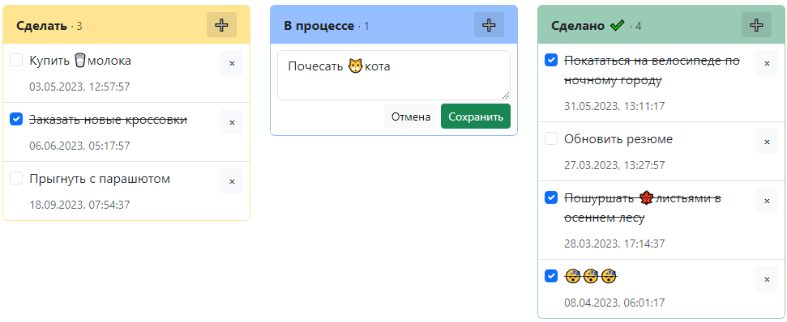

# Канбан-доска

Учебное приложение для изучения state-менеджера Redux(Redux toolkit).

Канбан-доска - это инструмент управления проектами и задачами. Представляет собой таблицу, состоящую из столбцов и строк.

**[Демо](https://mchlv.ru/projects/kanban)**

## Возможности
- Добавлениеи и редактирование задач;
- Добавление и редактирование групп;
- Редактирование названия доски.
- ... список дополняется 🙂

## Стек
- React.js
- Redux Toolkit
- Bootstrap

## Запуск

Действия стандартные для запуска create-react-app:

#### `npm start`

Запускает приложение в режиме разработки.

#### `npm run build`

Формирует production-версию приложения и выгружает файлы в папку `build`.

